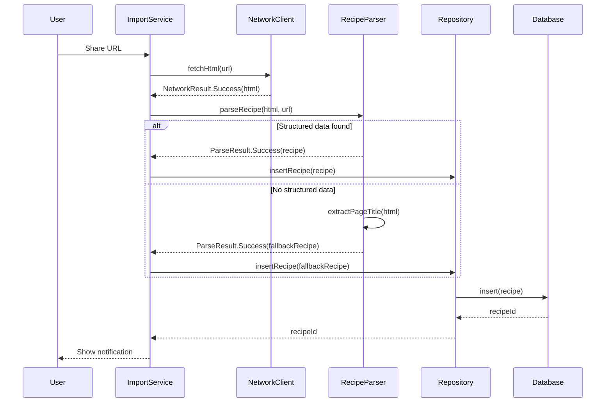
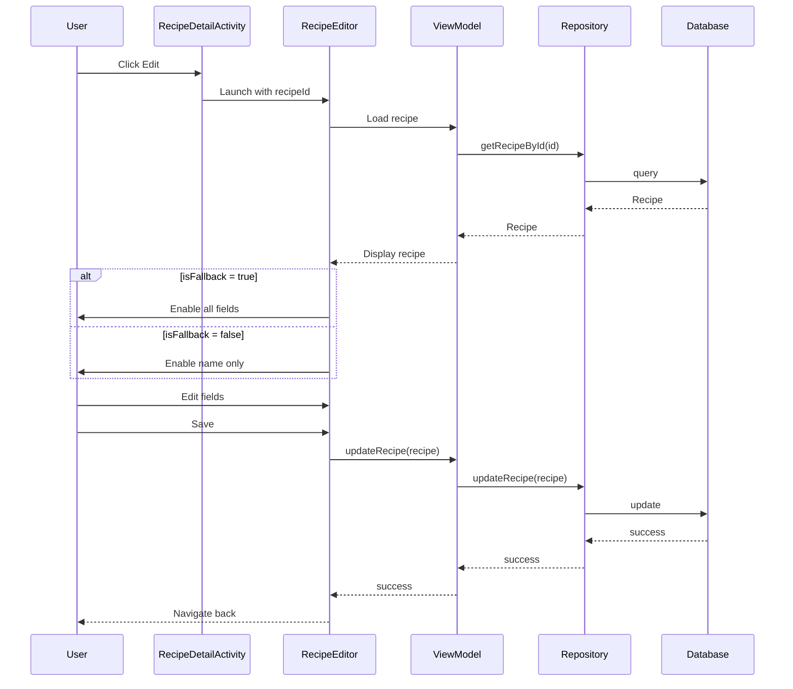
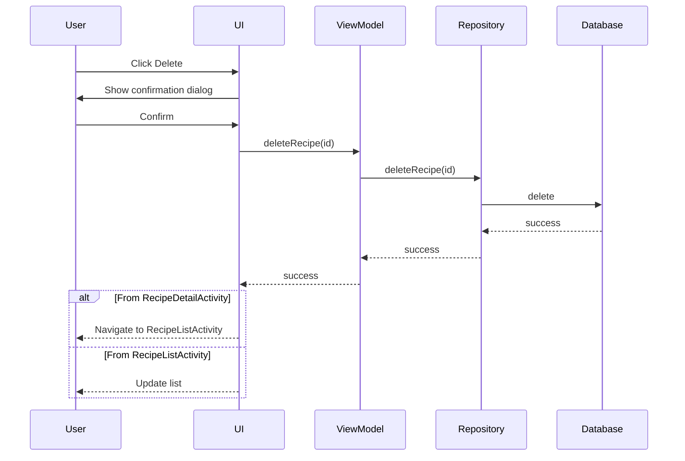

# Design Document: Fallback Recipe Import

## Overview

This feature extends the Recipe Bookmarks app to gracefully handle recipe URLs that lack structured data (JSON-LD, Microdata, RDFa). Currently, when the parser fails to extract structured recipe data, the import fails completely. This design introduces a fallback mechanism that creates a minimal recipe bookmark using the page title and URL, allowing users to save any recipe URL regardless of structured data availability.

The fallback mechanism operates transparently within the existing import flow. When structured data parsing fails, instead of returning a failure, the system creates a "fallback recipe" with the page title as the recipe name, an empty ingredients list, and an empty instructions list. The original URL is preserved for user access to the full recipe content.

This design also introduces recipe editing and deletion capabilities, enabling users to manually populate fallback recipes with ingredients and instructions, or remove recipes they no longer need.

### Key Design Decisions

1. **Non-nullable lists with empty defaults**: Rather than making ingredients/instructions nullable, we use empty lists for fallback recipes. This simplifies UI logic and maintains backward compatibility.

2. **isFallback flag**: A boolean flag distinguishes fallback recipes from fully-parsed recipes, enabling conditional UI behavior (editing restrictions, visual indicators).

3. **Title extraction fallback chain**: Page title → URL domain → "Untitled Recipe" ensures every fallback recipe has a meaningful name.

4. **Editing restrictions**: Only fallback recipes can have ingredients/instructions edited; fully-parsed recipes are considered authoritative and only allow name editing.

5. **Soft delete with confirmation**: Deletion requires user confirmation to prevent accidental data loss.

## Architecture

### Component Interaction Flow



### Editing Flow



### Deletion Flow



## Components and Interfaces

### 1. Data Model Changes

#### Recipe Entity

The Recipe entity requires two modifications:

1. Add `isFallback: Boolean` field (default: false)
2. Change ingredients/instructions from non-nullable to support empty lists

```kotlin
@Entity(tableName = "recipes")
@TypeConverters(Converters::class)
data class Recipe(
    @PrimaryKey(autoGenerate = true)
    val id: Long = 0,
    val name: String,
    val ingredients: List<Ingredient> = emptyList(),  // Changed: now defaults to empty
    val instructions: List<Instruction> = emptyList(), // Changed: now defaults to empty
    val yield: String? = null,
    val servingSize: String? = null,
    val nutritionInfo: NutritionInfo? = null,
    val originalUrl: String? = null,
    val category: Category? = null,
    val isFallback: Boolean = false,  // New field
    val createdAt: Long = System.currentTimeMillis(),
    val updatedAt: Long = System.currentTimeMillis()
)
```

**Migration Strategy**: Room will handle this migration automatically since:
- Adding a boolean field with a default value (false) is non-breaking
- Existing recipes will have `isFallback = false` (correct behavior)
- Empty list defaults are handled by the type converter
- No database schema change is required for list defaults

### 2. RecipeParser Modifications

#### New Method: extractPageTitle

```kotlin
interface RecipeParser {
    suspend fun parseRecipe(html: String, sourceUrl: String): ParseResult
    fun extractPageTitle(html: String): String  // New method
}
```

**Implementation in RecipeParserImpl**:

```kotlin
override fun extractPageTitle(html: String): String {
    return try {
        val document = Jsoup.parse(html)
        val title = document.select("title").text().trim()
        
        when {
            title.isNotBlank() -> title.take(200)  // Truncate to 200 chars
            else -> ""
        }
    } catch (e: Exception) {
        ""
    }
}
```

#### Modified parseRecipe Logic

The parseRecipe method will be modified to create fallback recipes when structured data parsing fails:

```kotlin
override suspend fun parseRecipe(html: String, sourceUrl: String): ParseResult = withContext(Dispatchers.Default) {
    try {
        val document = Jsoup.parse(html)
        
        // Try JSON-LD first
        val jsonLdResult = parseJsonLd(document, sourceUrl)
        if (jsonLdResult is ParseResult.Success) {
            return@withContext jsonLdResult
        }
        
        // Try Microdata
        val microdataResult = parseMicrodata(document, sourceUrl)
        if (microdataResult is ParseResult.Success) {
            return@withContext microdataResult
        }
        
        // Try RDFa
        val rdfaResult = parseRdfa(document, sourceUrl)
        if (rdfaResult is ParseResult.Success) {
            return@withContext rdfaResult
        }
        
        // All parsing methods failed - create fallback recipe
        createFallbackRecipe(html, sourceUrl)
    } catch (e: Exception) {
        // Even on exception, try to create fallback
        createFallbackRecipe(html, sourceUrl)
    }
}

private fun createFallbackRecipe(html: String, sourceUrl: String): ParseResult {
    val pageTitle = extractPageTitle(html)
    val recipeName = when {
        pageTitle.isNotBlank() -> pageTitle
        else -> generateNameFromUrl(sourceUrl)
    }
    
    val fallbackRecipe = Recipe(
        name = recipeName,
        ingredients = emptyList(),
        instructions = emptyList(),
        originalUrl = sourceUrl,
        isFallback = true
    )
    
    return ParseResult.Success(fallbackRecipe)
}

private fun generateNameFromUrl(url: String): String {
    return try {
        val uri = Uri.parse(url)
        uri.host?.removePrefix("www.") ?: "Untitled Recipe"
    } catch (e: Exception) {
        "Untitled Recipe"
    }
}
```

### 3. ImportService Changes

The ImportService requires minimal changes since the parser now returns Success for fallback recipes:

```kotlin
suspend fun handleSharedUrls(urls: List<String>): ImportSummary {
    var successCount = 0
    val failures = mutableListOf<ImportFailure>()
    val fallbackCount = mutableListOf<String>()  // Track fallback recipes
    
    for (url in urls) {
        try {
            val fetchResult = networkClient.fetchHtml(url)
            
            when (fetchResult) {
                is NetworkResult.Success -> {
                    val parseResult = recipeParser.parseRecipe(fetchResult.html, url)
                    
                    when (parseResult) {
                        is ParseResult.Success -> {
                            val recipeWithUrl = parseResult.recipe.copy(originalUrl = url)
                            val recipeId = recipeRepository.insertRecipe(recipeWithUrl)
                            
                            // Track if this was a fallback
                            if (recipeWithUrl.isFallback) {
                                fallbackCount.add(url)
                            }
                            
                            successCount++
                        }
                        is ParseResult.Failure -> {
                            // This should not happen anymore, but keep for safety
                            failures.add(ImportFailure(url, ImportError.PARSE_FAILED))
                        }
                    }
                }
                is NetworkResult.Failure -> {
                    // Handle network failures as before
                    val importError = when (fetchResult.error) {
                        NetworkError.URL_INACCESSIBLE,
                        NetworkError.INVALID_URL,
                        NetworkError.TIMEOUT -> ImportError.URL_INACCESSIBLE
                        NetworkError.NETWORK_ERROR -> ImportError.NETWORK_ERROR
                    }
                    failures.add(ImportFailure(url, importError))
                }
            }
        } catch (e: Exception) {
            failures.add(ImportFailure(url, ImportError.NETWORK_ERROR))
        }
    }
    
    return ImportSummary(
        successCount = successCount,
        failureCount = failures.size,
        failures = failures,
        fallbackCount = fallbackCount.size  // New field
    )
}
```

**ImportSummary Update**:

```kotlin
data class ImportSummary(
    val successCount: Int,
    val failureCount: Int,
    val failures: List<ImportFailure>,
    val fallbackCount: Int = 0  // New field
) : java.io.Serializable
```

### 4. Repository Changes

Add delete and update operations to RecipeRepository:

```kotlin
interface RecipeRepository {
    // Existing methods
    fun getAllRecipes(): Flow<List<Recipe>>
    fun getRecipeById(id: Long): Flow<Recipe?>
    fun searchRecipes(query: String): Flow<List<Recipe>>
    fun getRecipesByCategory(category: Category): Flow<List<Recipe>>
    suspend fun insertRecipe(recipe: Recipe): Long
    
    // New methods
    suspend fun updateRecipe(recipe: Recipe)  // For editing
    suspend fun deleteRecipe(id: Long)        // For deletion
    
    suspend fun importFromUrl(url: String): ImportResult
}
```

**Implementation in RecipeRepositoryImpl**:

```kotlin
override suspend fun updateRecipe(recipe: Recipe) {
    recipeDao.update(recipe.copy(updatedAt = System.currentTimeMillis()))
}

override suspend fun deleteRecipe(id: Long) {
    recipeDao.deleteById(id)
}
```

### 5. DAO Changes

Add corresponding DAO methods:

```kotlin
@Dao
interface RecipeDao {
    // Existing methods
    @Query("SELECT * FROM recipes ORDER BY createdAt DESC")
    fun getAllRecipes(): Flow<List<Recipe>>
    
    @Query("SELECT * FROM recipes WHERE id = :id")
    fun getRecipeById(id: Long): Flow<Recipe?>
    
    @Insert(onConflict = OnConflictStrategy.REPLACE)
    suspend fun insert(recipe: Recipe): Long
    
    // New methods
    @Update
    suspend fun update(recipe: Recipe)
    
    @Query("DELETE FROM recipes WHERE id = :id")
    suspend fun deleteById(id: Long)
}
```

### 6. UI Components

#### RecipeListAdapter Changes

Add visual indicator for fallback recipes and delete button:

```kotlin
class RecipeViewHolder(
    itemView: View,
    private val onRecipeClick: (Recipe) -> Unit,
    private val onDeleteClick: (Recipe) -> Unit  // New callback
) : RecyclerView.ViewHolder(itemView) {
    private val recipeName: TextView = itemView.findViewById(R.id.recipeName)
    private val categoryTag: TextView = itemView.findViewById(R.id.categoryTag)
    private val fallbackIndicator: TextView = itemView.findViewById(R.id.fallbackIndicator)  // New view
    private val deleteButton: ImageButton = itemView.findViewById(R.id.deleteButton)  // New view

    fun bind(recipe: Recipe) {
        recipeName.text = recipe.name
        
        categoryTag.text = recipe.category?.name?.lowercase()?.replaceFirstChar { it.uppercase() }
            ?: itemView.context.getString(R.string.uncategorized)
        
        // Show fallback indicator if this is a fallback recipe
        if (recipe.isFallback) {
            fallbackIndicator.visibility = View.VISIBLE
            fallbackIndicator.text = itemView.context.getString(R.string.fallback_recipe_indicator)
        } else {
            fallbackIndicator.visibility = View.GONE
        }
        
        // Set up delete button
        deleteButton.setOnClickListener {
            onDeleteClick(recipe)
        }
        
        itemView.setOnClickListener {
            onRecipeClick(recipe)
        }
    }
}
```

#### RecipeDetailActivity Changes

Add edit and delete buttons:

```kotlin
class RecipeDetailActivity : AppCompatActivity() {
    private lateinit var editButton: Button
    private lateinit var deleteButton: Button
    
    override fun onCreate(savedInstanceState: Bundle?) {
        super.onCreate(savedInstanceState)
        setContentView(R.layout.activity_recipe_detail)
        
        // ... existing initialization ...
        
        editButton = findViewById(R.id.editButton)
        deleteButton = findViewById(R.id.deleteButton)
        
        editButton.setOnClickListener {
            val recipeId = intent.getLongExtra(RecipeListActivity.EXTRA_RECIPE_ID, -1L)
            val intent = Intent(this, RecipeEditorActivity::class.java)
            intent.putExtra(EXTRA_RECIPE_ID, recipeId)
            startActivity(intent)
        }
        
        deleteButton.setOnClickListener {
            showDeleteConfirmation()
        }
        
        // Observe recipe to show fallback message
        lifecycleScope.launch {
            repeatOnLifecycle(Lifecycle.State.STARTED) {
                viewModel.recipe.collect { recipe ->
                    recipe?.let {
                        // ... existing display logic ...
                        displayFallbackMessage(it)
                    }
                }
            }
        }
    }
    
    private fun displayFallbackMessage(recipe: Recipe) {
        val fallbackMessageTextView = findViewById<TextView>(R.id.fallbackMessageTextView)
        
        if (recipe.isFallback) {
            fallbackMessageTextView.visibility = View.VISIBLE
            fallbackMessageTextView.text = getString(R.string.fallback_recipe_message)
        } else {
            fallbackMessageTextView.visibility = View.GONE
        }
    }
    
    private fun showDeleteConfirmation() {
        lifecycleScope.launch {
            val recipe = viewModel.recipe.value ?: return@launch
            
            AlertDialog.Builder(this@RecipeDetailActivity)
                .setTitle(getString(R.string.delete_recipe_title))
                .setMessage(getString(R.string.delete_recipe_message, recipe.name))
                .setPositiveButton(getString(R.string.delete)) { _, _ ->
                    viewModel.deleteRecipe()
                    finish()  // Navigate back to list
                }
                .setNegativeButton(getString(R.string.cancel), null)
                .show()
        }
    }
}
```

#### New Component: RecipeEditorActivity

A new activity for editing recipes:

```kotlin
class RecipeEditorActivity : AppCompatActivity() {
    private lateinit var viewModel: RecipeEditorViewModel
    private lateinit var recipeNameEditText: EditText
    private lateinit var ingredientsContainer: LinearLayout
    private lateinit var instructionsContainer: LinearLayout
    private lateinit var addIngredientButton: Button
    private lateinit var addInstructionButton: Button
    private lateinit var saveButton: Button
    private lateinit var cancelButton: Button
    
    override fun onCreate(savedInstanceState: Bundle?) {
        super.onCreate(savedInstanceState)
        setContentView(R.layout.activity_recipe_editor)
        
        val recipeId = intent.getLongExtra(EXTRA_RECIPE_ID, -1L)
        
        // Initialize ViewModel
        val database = RecipeDatabase.getDatabase(applicationContext)
        val repository = RecipeRepositoryImpl(database.recipeDao())
        val viewModelFactory = RecipeEditorViewModelFactory(repository, recipeId)
        viewModel = ViewModelProvider(this, viewModelFactory)[RecipeEditorViewModel::class.java]
        
        // Initialize views
        recipeNameEditText = findViewById(R.id.recipeNameEditText)
        ingredientsContainer = findViewById(R.id.ingredientsContainer)
        instructionsContainer = findViewById(R.id.instructionsContainer)
        addIngredientButton = findViewById(R.id.addIngredientButton)
        addInstructionButton = findViewById(R.id.addInstructionButton)
        saveButton = findViewById(R.id.saveButton)
        cancelButton = findViewById(R.id.cancelButton)
        
        // Observe recipe and populate fields
        lifecycleScope.launch {
            repeatOnLifecycle(Lifecycle.State.STARTED) {
                viewModel.recipe.collect { recipe ->
                    recipe?.let {
                        populateFields(it)
                        configureEditingRestrictions(it)
                    }
                }
            }
        }
        
        // Set up button listeners
        addIngredientButton.setOnClickListener { addIngredientField() }
        addInstructionButton.setOnClickListener { addInstructionField() }
        saveButton.setOnClickListener { saveRecipe() }
        cancelButton.setOnClickListener { finish() }
    }
    
    private fun populateFields(recipe: Recipe) {
        recipeNameEditText.setText(recipe.name)
        
        // Populate ingredients
        ingredientsContainer.removeAllViews()
        recipe.ingredients.forEach { ingredient ->
            addIngredientField(ingredient)
        }
        
        // Populate instructions
        instructionsContainer.removeAllViews()
        recipe.instructions.forEach { instruction ->
            addInstructionField(instruction)
        }
    }
    
    private fun configureEditingRestrictions(recipe: Recipe) {
        if (recipe.isFallback) {
            // Enable all fields for fallback recipes
            recipeNameEditText.isEnabled = true
            addIngredientButton.visibility = View.VISIBLE
            addInstructionButton.visibility = View.VISIBLE
        } else {
            // Only allow name editing for non-fallback recipes
            recipeNameEditText.isEnabled = true
            addIngredientButton.visibility = View.GONE
            addInstructionButton.visibility = View.GONE
            
            // Disable ingredient/instruction fields
            for (i in 0 until ingredientsContainer.childCount) {
                ingredientsContainer.getChildAt(i).isEnabled = false
            }
            for (i in 0 until instructionsContainer.childCount) {
                instructionsContainer.getChildAt(i).isEnabled = false
            }
        }
    }
    
    private fun addIngredientField(ingredient: Ingredient? = null) {
        // Create ingredient input fields (name, quantity, unit)
        // Add remove button
        // Implementation details omitted for brevity
    }
    
    private fun addInstructionField(instruction: Instruction? = null) {
        // Create instruction input field
        // Add remove button
        // Implementation details omitted for brevity
    }
    
    private fun saveRecipe() {
        // Collect data from fields
        // Validate
        // Call viewModel.saveRecipe()
        // Navigate back
    }
    
    companion object {
        const val EXTRA_RECIPE_ID = "recipe_id"
    }
}
```

#### RecipeEditorViewModel

```kotlin
class RecipeEditorViewModel(
    private val repository: RecipeRepository,
    private val recipeId: Long
) : ViewModel() {
    
    private val _recipe = MutableStateFlow<Recipe?>(null)
    val recipe: StateFlow<Recipe?> = _recipe.asStateFlow()
    
    init {
        viewModelScope.launch {
            repository.getRecipeById(recipeId).collect { recipe ->
                _recipe.value = recipe
            }
        }
    }
    
    fun saveRecipe(updatedRecipe: Recipe) {
        viewModelScope.launch {
            repository.updateRecipe(updatedRecipe)
        }
    }
}
```

#### RecipeDetailViewModel Changes

Add delete method:

```kotlin
class RecipeDetailViewModel(
    private val repository: RecipeRepository,
    private val scalingCalculator: ScalingCalculator,
    private val recipeId: Long
) : ViewModel() {
    
    // ... existing code ...
    
    fun deleteRecipe() {
        viewModelScope.launch {
            repository.deleteRecipe(recipeId)
        }
    }
}
```

### 7. Notification Changes

Update ImportNotificationHelper to show different messages for fallback recipes:

```kotlin
class ImportNotificationHelper(private val context: Context) {
    
    fun showImportSummary(summary: ImportSummary) {
        val message = when {
            summary.failureCount == 0 && summary.fallbackCount == 0 -> {
                context.getString(R.string.import_success_all, summary.successCount)
            }
            summary.failureCount == 0 && summary.fallbackCount > 0 -> {
                context.getString(
                    R.string.import_success_with_fallbacks,
                    summary.successCount,
                    summary.fallbackCount
                )
            }
            else -> {
                context.getString(
                    R.string.import_mixed_results,
                    summary.successCount,
                    summary.fallbackCount,
                    summary.failureCount
                )
            }
        }
        
        // Show notification or toast
        Toast.makeText(context, message, Toast.LENGTH_LONG).show()
    }
}
```

## Data Models

### Recipe Entity Schema

```kotlin
@Entity(tableName = "recipes")
@TypeConverters(Converters::class)
data class Recipe(
    @PrimaryKey(autoGenerate = true)
    val id: Long = 0,
    
    @ColumnInfo(name = "name")
    val name: String,
    
    @ColumnInfo(name = "ingredients")
    val ingredients: List<Ingredient> = emptyList(),
    
    @ColumnInfo(name = "instructions")
    val instructions: List<Instruction> = emptyList(),
    
    @ColumnInfo(name = "yield")
    val yield: String? = null,
    
    @ColumnInfo(name = "serving_size")
    val servingSize: String? = null,
    
    @ColumnInfo(name = "nutrition_info")
    val nutritionInfo: NutritionInfo? = null,
    
    @ColumnInfo(name = "original_url")
    val originalUrl: String? = null,
    
    @ColumnInfo(name = "category")
    val category: Category? = null,
    
    @ColumnInfo(name = "is_fallback")
    val isFallback: Boolean = false,
    
    @ColumnInfo(name = "created_at")
    val createdAt: Long = System.currentTimeMillis(),
    
    @ColumnInfo(name = "updated_at")
    val updatedAt: Long = System.currentTimeMillis()
)
```

### Type Converter Updates

The existing Converters class already handles List<Ingredient> and List<Instruction> serialization. No changes needed, but ensure it handles empty lists correctly:

```kotlin
class Converters {
    private val gson = Gson()
    
    @TypeConverter
    fun fromIngredientList(value: List<Ingredient>?): String {
        return gson.toJson(value ?: emptyList())
    }
    
    @TypeConverter
    fun toIngredientList(value: String): List<Ingredient> {
        val listType = object : TypeToken<List<Ingredient>>() {}.type
        return gson.fromJson(value, listType) ?: emptyList()
    }
    
    @TypeConverter
    fun fromInstructionList(value: List<Instruction>?): String {
        return gson.toJson(value ?: emptyList())
    }
    
    @TypeConverter
    fun toInstructionList(value: String): List<Instruction> {
        val listType = object : TypeToken<List<Instruction>>() {}.type
        return gson.fromJson(value, listType) ?: emptyList()
    }
    
    // ... other converters ...
}
```


## Correctness Properties

*A property is a characteristic or behavior that should hold true across all valid executions of a system—essentially, a formal statement about what the system should do. Properties serve as the bridge between human-readable specifications and machine-verifiable correctness guarantees.*

### Property 1: Fallback Recipe Creation on Parse Failure

*For any* HTML page without structured recipe data (JSON-LD, Microdata, or RDFa), when the parser attempts to extract recipe information, the system should create a fallback recipe with isFallback=true rather than returning a parse failure.

**Validates: Requirements 1.1**

### Property 2: Fallback Recipe URL Preservation

*For any* URL that results in a fallback recipe, the created recipe should contain the original URL in the originalUrl field.

**Validates: Requirements 1.2**

### Property 3: Recipe Name Extraction from Page Title

*For any* HTML page with a non-empty title element, when creating a fallback recipe, the system should extract the full page title text (trimmed and truncated to 200 characters) as the recipe name.

**Validates: Requirements 1.3, 2.1, 2.3, 2.4**

### Property 4: Fallback Recipes Have Empty Lists

*For any* fallback recipe created by the parser, both the ingredients list and instructions list should be empty.

**Validates: Requirements 1.5, 1.6**

### Property 5: Fallback Recipe Persistence

*For any* fallback recipe created by the import service, when saved to the repository, querying the database by the returned recipe ID should retrieve a recipe with matching data.

**Validates: Requirements 1.7**

### Property 6: Domain Name Fallback for Missing Titles

*For any* URL with HTML that lacks a title element or has an empty title, when creating a fallback recipe, the system should extract the domain name from the URL as the recipe name.

**Validates: Requirements 1.4, 2.2**

### Property 7: Structured Data Parsing Preserved

*For any* HTML page containing valid structured recipe data (JSON-LD, Microdata, or RDFa), the parser should create a recipe with isFallback=false and populated ingredients and instructions lists.

**Validates: Requirements 5.1**

### Property 8: Empty List Support in Data Model

*For any* recipe with empty ingredients and instructions lists, the system should successfully save the recipe to the database and retrieve it with the lists intact as empty.

**Validates: Requirements 5.3**

### Property 9: Recipe Name Editing for All Recipes

*For any* recipe (regardless of isFallback value), the recipe editor should allow modification of the recipe name field.

**Validates: Requirements 7.1**

### Property 10: Ingredient List Editing Operations

*For any* fallback recipe being edited, the system should support adding new ingredients (increasing list size), modifying existing ingredients (changing their data), and removing ingredients (decreasing list size).

**Validates: Requirements 7.6, 7.7, 7.8**

### Property 11: Instruction List Editing Operations

*For any* fallback recipe being edited, the system should support adding new instructions (increasing list size), modifying existing instructions (changing their text), and removing instructions (decreasing list size).

**Validates: Requirements 7.9, 7.10, 7.11**

### Property 12: Recipe Edit Persistence

*For any* recipe that has been edited and saved, querying the database should return the recipe with all modifications applied and an updated updatedAt timestamp.

**Validates: Requirements 7.12**

### Property 13: Recipe Deletion Confirmation

*For any* recipe, when the user confirms deletion, the recipe should be removed from the database and subsequent queries for that recipe ID should return null.

**Validates: Requirements 8.7**

### Property 14: Recipe Deletion Cancellation

*For any* recipe, when the user cancels deletion, the recipe should remain in the database unchanged.

**Validates: Requirements 8.8**

## Error Handling

### Parse Errors

The parser no longer returns ParseResult.Failure for missing structured data. Instead, it creates fallback recipes. However, ParseResult.Failure is still used for:

1. **Invalid HTML**: When the HTML cannot be parsed by Jsoup
2. **Network errors**: Handled at the ImportService level, not parser level

Error handling strategy:
- Catch all exceptions in parseRecipe and attempt to create a fallback recipe
- If fallback creation fails (extremely rare), return ParseResult.Failure(ParseError.INVALID_HTML)
- Log all parsing attempts for debugging

### Network Errors

Network errors are handled by ImportService and remain unchanged:
- URL_INACCESSIBLE: Invalid URL, timeout, or unreachable host
- NETWORK_ERROR: General network failures

### Database Errors

Database operations (insert, update, delete) may throw exceptions:
- **Insert failures**: Log error and return failure to user via ImportSummary
- **Update failures**: Show error toast to user in RecipeEditorActivity
- **Delete failures**: Show error toast to user and don't navigate away

### UI Error States

1. **Empty recipe list**: Show "No recipes yet" message
2. **Failed to load recipe**: Show error message in RecipeDetailActivity
3. **Failed to save edits**: Show error toast and keep editor open
4. **Failed to delete**: Show error toast and keep recipe visible

### Validation Errors

Recipe editor validation:
- **Empty recipe name**: Show error, prevent save
- **Invalid ingredient quantity**: Show error, prevent save
- **Empty ingredient name**: Show error, prevent save
- **Empty instruction text**: Show error, prevent save

## Testing Strategy

### Dual Testing Approach

This feature requires both unit tests and property-based tests for comprehensive coverage:

- **Unit tests**: Verify specific examples, edge cases, UI interactions, and integration points
- **Property tests**: Verify universal properties across randomized inputs

### Property-Based Testing

We will use **Kotest Property Testing** library for Kotlin. Each property test will:
- Run minimum 100 iterations with randomized inputs
- Reference the design document property in a comment tag
- Use Kotest's property test generators (Arb) for input generation

**Property Test Configuration**:

```kotlin
class FallbackRecipePropertyTests : StringSpec({
    "Property 1: Fallback Recipe Creation on Parse Failure" {
        // Feature: fallback-recipe-import, Property 1
        checkAll(100, Arb.htmlWithoutStructuredData()) { html ->
            val parser = RecipeParserImpl()
            val result = parser.parseRecipe(html, "https://example.com")
            
            result shouldBe instanceOf<ParseResult.Success>()
            val recipe = (result as ParseResult.Success).recipe
            recipe.isFallback shouldBe true
        }
    }
    
    "Property 3: Recipe Name Extraction from Page Title" {
        // Feature: fallback-recipe-import, Property 3
        checkAll(100, Arb.htmlWithTitle()) { (html, expectedTitle) ->
            val parser = RecipeParserImpl()
            val result = parser.parseRecipe(html, "https://example.com")
            
            val recipe = (result as ParseResult.Success).recipe
            val truncatedTitle = expectedTitle.trim().take(200)
            recipe.name shouldBe truncatedTitle
        }
    }
    
    // Additional property tests for each property...
})
```

**Custom Generators**:

```kotlin
fun Arb.Companion.htmlWithoutStructuredData(): Arb<String> = arbitrary {
    val title = Arb.string(1..100).bind()
    "<html><head><title>$title</title></head><body><p>Recipe content</p></body></html>"
}

fun Arb.Companion.htmlWithTitle(): Arb<Pair<String, String>> = arbitrary {
    val title = Arb.string(1..300).bind()
    val html = "<html><head><title>$title</title></head><body></body></html>"
    html to title
}

fun Arb.Companion.fallbackRecipe(): Arb<Recipe> = arbitrary {
    Recipe(
        name = Arb.string(1..200).bind(),
        ingredients = emptyList(),
        instructions = emptyList(),
        originalUrl = Arb.string(10..100).bind(),
        isFallback = true
    )
}
```

### Unit Testing

Unit tests focus on specific examples, edge cases, and UI interactions:

**Parser Tests**:
- Test specific HTML structures (with/without title)
- Test title truncation at exactly 200 characters
- Test domain extraction from various URL formats
- Test exception handling

**ImportService Tests**:
- Test import summary calculation with fallback recipes
- Test notification message selection based on fallback count
- Test mixed results (some success, some fallback, some failure)

**Repository Tests**:
- Test insert/update/delete operations
- Test querying recipes by ID
- Test filtering fallback vs non-fallback recipes

**UI Tests**:
- Test RecipeListAdapter displays fallback indicator
- Test RecipeDetailActivity shows fallback message
- Test RecipeEditorActivity enables/disables fields based on isFallback
- Test delete confirmation dialog shows recipe name
- Test navigation after deletion

**Integration Tests**:
- Test end-to-end import flow from URL to database
- Test end-to-end edit flow from UI to database
- Test end-to-end delete flow from UI to database

### Test Coverage Goals

- **Parser**: 90%+ line coverage, all branches covered
- **ImportService**: 85%+ line coverage, all error paths covered
- **Repository**: 95%+ line coverage (straightforward CRUD)
- **ViewModels**: 80%+ line coverage, all state transitions covered
- **UI Components**: Focus on interaction tests, not pixel-perfect rendering

### Edge Cases to Test

1. **Empty HTML**: Parser should create fallback with "Untitled Recipe"
2. **Malformed HTML**: Parser should handle gracefully and create fallback
3. **Very long titles**: Truncation at 200 characters
4. **Titles with only whitespace**: Should trigger domain fallback
5. **URLs without domain**: Should use "Untitled Recipe"
6. **Concurrent edits**: Last write wins (Room handles this)
7. **Deleting non-existent recipe**: Should fail gracefully
8. **Editing deleted recipe**: Should show error

### Testing Tools

- **Kotest**: Property-based testing framework
- **MockK**: Mocking framework for unit tests
- **Robolectric**: Android UI testing without emulator
- **Espresso**: Integration tests on emulator/device
- **Truth**: Assertion library for readable tests

